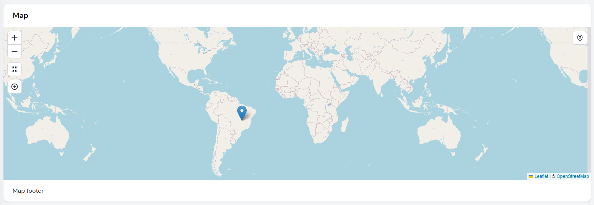
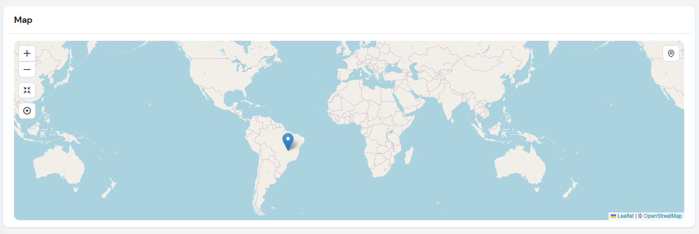

# Filament Maps


Render map widgets using [Leaflet](https://leafletjs.com/).

## Installation

```bash
composer require webbingbrasil/filament-maps
```

## Usage
 
Create a widget class and extend `Webbingbrasil\FilamentMaps\Widgets\MapWidget`:

```php
use Webbingbrasil\FilamentMaps\Actions;
use Webbingbrasil\FilamentMaps\Marker;
use Webbingbrasil\FilamentMaps\Widgets\MapWidget;

class Map extends MapWidget
{
    protected int | string | array $columnSpan = 2;
    
    protected bool $hasBorder = false;

    public function getMarkers(): array
    {
        return [
            Marker::make('pos2')->lat(-15.7942)->lng(-47.8822)->popup('Hello Brasilia!'),
        ];
    }

    public function getActions(): array
    {
        return [
            Actions\ZoomAction::make(),
            Actions\CenterMapAction::make()->zoom(2),
        ];
    }
}
```

## Map Options

You can pass to widget any options available on Leaftlet map constructor. See [Leaflet documentation](https://leafletjs.com/reference.html#map-option) for more details.

```php
protected array $mapOptions = ['center' => [0, 0], 'zoom' => 2];
```

## Tile Layers

The map uses OpenStreetMap tiles by default, but you can change it to use any other provider using `getTileLayerUrl()` method or `$tileLayerUrl` property:

```php
protected string | array $tileLayerUrl = 'https://{s}.tile.openstreetmap.org/{z}/{x}/{y}.png';

protected array $tileLayerOptions = [
    'attribution' => 'Map data © <a href="https://openstreetmap.org">OpenStreetMap</a> contributors',
];
```

### Multiple Tile Layers

You can also use multiple tile layers:

```php
protected array $tileLayerUrl = [
    'OpenStreetMap' => 'https://{s}.tile.openstreetmap.org/{z}/{x}/{y}.png',
    'OpenTopoMap' => 'https://{s}.tile.opentopomap.org/{z}/{x}/{y}.png'
];

protected array $tileLayerOptions = [
    'OpenStreetMap' => [
        'attribution' => 'Map data © <a href="https://openstreetmap.org">OpenStreetMap</a> contributors',
    ],
    'OpenTopoMap' => [
        'attribution' => 'Map data © <a href="https://openstreetmap.org">OpenStreetMap</a> contributors, SRTM | Map style © <a href="https://opentopomap.org">OpenTopoMap</a> (<a href="https://creativecommons.org/licenses/by-sa/3.0/">CC-BY-SA</a>)',
    ],
];
```

And use a action to change the tile layer:

```php
Actions\Action::make('mode')
                ->icon('filamentmapsicon-o-square-3-stack-3d')
                ->callback('setTileLayer(mode === "OpenStreetMap" ? "OpenTopoMap" : "OpenStreetMap")'),
```

### Dark Mode

If you want to use a dark mode tile layer, you can use the `HasDarkModeTiles` trait. This trait will automatically set two tiles layers and listen Filament `dark-mode-toggled` event. You can change the default tile layers using the `$lightModeTileLayerUrl` and `$darkModeTileLayerUrl` properties.

## Actions

You can add actions to the map widget. Actions are buttons that can be clicked to perform an action using a JS callback. You can create your own actions or use the ones provided by the package.

### Center Map Action

This action will center the map on a specific position.

```php
use Webbingbrasil\FilamentMaps\Actions;

public function getActions(): array
{
    return [
        Actions\CenterMapAction::make()->centerTo([51.505, -0.09])->zoom(13),
    ];
}
```

You can also center the map on user position:

```php
    Actions\UserPositionAction::make()->centerOnUserPosition()->zoom(13)
```

> Note: This action will only work if the user browser supports [Navigator.geolocation](https://developer.mozilla.org/en-US/docs/Web/API/Navigator/geolocation). Also, the user must be on a secure context (HTTPS) and needs to allow access to the location.

### Custom Action

You can create your own actions using `Webbingbrasil\FilamentMaps\Actions\Action`.

For example, a action to add new markers:

```php
use Webbingbrasil\FilamentMaps\Actions;

Actions\Action::make('form')
        ->icon('filamentmapsicon-o-arrows-pointing-in')
        ->form([
            Forms\Components\TextInput::make('name')
                ->label('Name')
                ->required(),
            Forms\Components\TextInput::make('lat')
                ->label('Latitude')
                ->required(),
            Forms\Components\TextInput::make('lng')
                ->label('Longitude')
                ->required(),
        ])
        ->action(function (array $data, self $livewire) {
            $livewire
                ->addMarker(
                    Marker::make(Str::camel($data['name']))
                        ->lat($data['lat'])
                        ->lng($data['lng'])
                        ->popup($data['name'])
                );
        })
```

In this example we use `addMarker()` method to add a new marker dynamically. You can also use `removeMarker()` and `updateMarker()` methods.

```php
$liveWire->removeMarker('marker-name');
$liveWire->updateMarker(Marker::make('marker-name')->lat(...)->lng(...));
```

> Note: Markers need to have a unique name. If you try to add a marker with the same name as an existing one, the existing one will be replaced.

#### Using JS Callback

This approach is useful if you want to use a custom javascript to manipulate the map without using Livewire.

```php
Actions\Action::make('center')
    ->callback(<<<JS
        () => { map.setView([0,0], 2) }
    JS)
```

> Use `map` property to access the Leaflet instance on your action callback.

### Action Position

You can set the position of the action using `position()` method:

```php
$this
    ->actions([
        Actions\CenterMapAction::make()->position('topright'),
    ])
}
```

### Action Icon

You can set the icon of the action using `icon()` method:

```php
Actions\Action::make()->icon('heroicon-o-home')
```


## Markers

You can add markers to the map widget. Markers are points on the map that can be clicked to open a info popup or execute a JS callback.

```php
use Webbingbrasil\FilamentMaps\Marker;

$this
    ->mapMarkers([
        Marker::make('id')
            ->lat(51.505)
            ->lng(-0.09)
            ->popup('I am a popup'),
        Marker::make('id')
            ->lat(51.505)
            ->lng(-0.09)
            ->callback(<<<JS
                () => {
                    alert('Hello World!');
                }
            JS),
    ])
}
```

>Use `map` to access the Leaflet instance on your action callback.

## Widget Customization

You can customize the widget using the following methods:

- `hasBorder()`: set to `true` to show a border around the map. Default is `true`.
- `rounded()`: set to `true` to show a rounded border around the map. Default is `true`.
- `height()`: set the height of the map. Default is `400px`.
- `heading()`: set the heading of the map.
- `footer()`: set the footer of the map.

## Images






## Credits

-   [Danilo Andrade](https://github.com/dmandrade)

